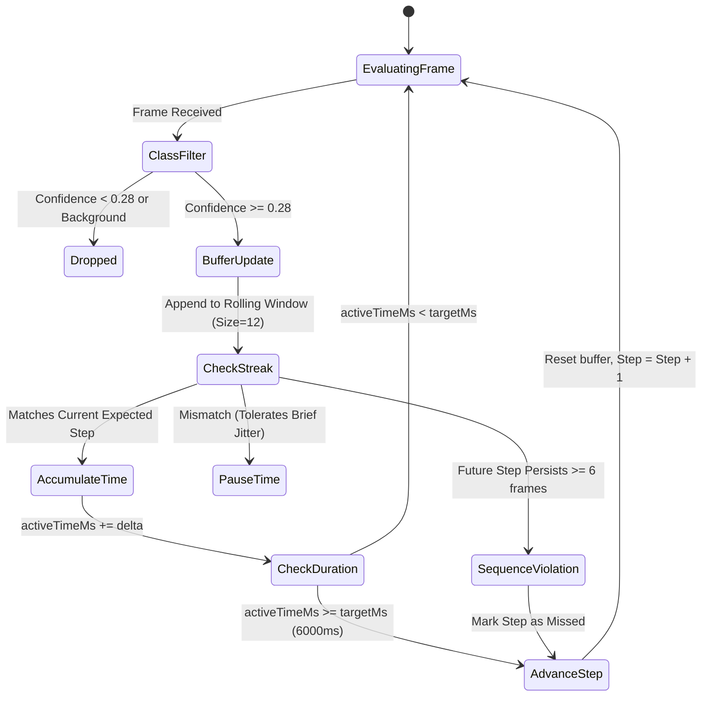

# SMART WASH: Autonomous AI-Powered Handwashing Compliance & Monitoring System
## Engineering Project Report & System Architecture Specification

---

### Executive Summary
**SMART WASH** is a software-only, camera-based computer vision kiosk designed to track, guide, and score handwashing compliance in real-time according to World Health Organization (WHO) standards. Operating completely free of physical microcontrollers or specialized sensor hardware, the system uses an off-the-shelf RGB camera connected to a distributed edge computing architecture. 

The system leverages:
1. **Ultralytics YOLOv11** classification running on a high-throughput Python FastAPI WebSocket backend for real-time hand action recognition.
2. **face-api.js** running client-side for touchless biometric student identification using 128-dimensional facial embeddings.
3. **MediaPipe Selfie Segmentation** running locally via WebAssembly (WASM) for depth-aware, privacy-preserving background blurring.
4. A **Temporal State Machine Engine** that filters out classification noise, requires consecutive valid frames, accumulates actual washing duration, and prevents artificial progression.
5. An **Explainable Compliance Scoring Engine** that evaluates completion ratio, duration quality, and model confidence deterministically.
6. A **Teacher Analytics Dashboard** providing live student rosters, class compliance rates, streak tracking, and leaderboard rankings.

---

## 1. Problem Statement & Motivation
Hospital-acquired infections and school-borne contagions are overwhelmingly transmitted via improper hand hygiene. While the WHO outlines a rigorous 6-step handwashing technique, human compliance in schools is typically below 30% due to rushing, skipping steps, or lack of guidance. 

Traditional tracking attempts rely on physical timers, RFID badges, or plumbing flow sensors—none of which can verify whether a student is performing the correct physical hand gestures. SMART WASH solves this by providing continuous, automated visual validation using deep neural networks directly from a commodity webcam.

---

## 2. Technology Stack

### Frontend & Kiosk Client
- **Core Framework**: React 18 (SPA Architecture)
- **Build System & Dev Server**: Vite 5.4
- **Styling**: Vanilla CSS with glassmorphism, responsive CSS grid, and dynamic HUD overlays
- **Biometric Face Recognition**: `face-api.js` (SSD MobileNet V1 face detector + 68-point landmark predictor + 128-d face embedding network)
- **Background Privacy Filter**: `@mediapipe/selfie_segmentation` running via browser-local WebAssembly (WASM)
- **Routing**: `react-router-dom` v6 (`/student` kiosk and `/teacher` dashboard)
- **Unit Testing**: Vitest 1.6

### AI & Backend Inference Engine
- **Web Framework**: FastAPI (Python 3.11 asynchronous ASGI server)
- **ASGI Server**: Uvicorn running on port 4550
- **Computer Vision Model**: Ultralytics YOLOv11n-cls (`best.pt`)
- **Deep Learning Runtime**: PyTorch with GPU (CUDA) and CPU fallback
- **Real-Time Streaming Protocol**: Bidirectional WebSockets (`ws://localhost:4550/ws_model`)
- **Image Processing**: OpenCV (`cv2`), NumPy, Pillow, Base64 decoding

### Persistence & Storage
- **Local Persistence**: Browser `localStorage` multi-tab synchronization for offline/edge testing
- **Production Architecture**: Google Cloud Firestore & Firebase Storage integration ready (`shared/firebaseConfig.js`)

---

## 3. End-to-End System Workflow

```
+---------------------------------------------------------------------------------------------------+
|                                       SMART WASH WORKFLOW                                         |
+---------------------------------------------------------------------------------------------------+

   +-------------+       +-------------------+       +--------------------------------------------+
   |   Camera    | ----> | Face Detection    | ----> | Match 128-d Face Vector against DB         |
   |   Stream    |       | (face-api.js)     |       | (Alex River, Jordan Taylor, Sam Chen, ...) |
   +-------------+       +-------------------+       +--------------------------------------------+
         |                                                                 |
         | (WASM Compositing)                                              v
         v                                                      [ Student Identified ]
   +-------------------+                                                   |
   | MediaPipe Blur    |                                                   v
   | (Sharp Subject +  |                                         +-------------------+
   | 5px Bokeh Blur)   |                                         | Initialize Session|
   +-------------------+                                         +-------------------+
                                                                           |
         +-----------------------------------------------------------------+
         |
         v
   +----------------------------------------------------------------------------------------------+
   |                                    WASHING STATE (WHO STEPS)                                 |
   |                                                                                              |
   |  Webcam Frames (320x320 @ 10 FPS) ---> WebSocket ---> FastAPI YOLOv11 Inference (`best.pt`) |
   |                                                                   |                          |
   |  Step State Machine <--- Filtered Prediction Class & Conf <-------+                          |
   |          |                                                                                   |
   |          v                                                                                   |
   |  [Consecutive Frame Validation] -> [Temporal Duration Accumulation] -> [Next Step]         |
   +----------------------------------------------------------------------------------------------+
         |
         | (All Steps Complete or Timeout)
         v
   +----------------------------------------------------------------------------------------------+
   |                                 SCORING & FEEDBACK STATE                                     |
   |                                                                                              |
   |  Deterministic Scoring Formula:                                                              |
   |  Base Completion (60%) + Duration Quality (25%) + AI Confidence (15%) - Penalties            |
   |  Score saved to LocalStorage & Firestore                                                    |
   |  Student views Score Dial + Step Breakdown -> Auto-resets to IDLE after 8s                   |
   +----------------------------------------------------------------------------------------------+
         |
         v
   +----------------------------------------------------------------------------------------------+
   |                                    TEACHER DASHBOARD                                         |
   |                                                                                              |
   |  Live Session History -> Class Average Score -> Student Streaks -> Compliance Leaderboard     |
   +----------------------------------------------------------------------------------------------+
```

---

## 4. Computer Vision & Machine Learning Methodology

### 4.1 YOLOv11 Hand Action Classifier (`best.pt`)
The hand movement classification model is an Ultralytics YOLOv11 classification network trained on the EDI-Riga Handwashing Dataset.

- **Input Dimension**: $256 \times 256 \times 3$ RGB
- **Model Output**: 13 discrete class probabilities via softmax activation:
  - `0: Step_1`
  - `1: Step_2_Left`, `2: Step_2_Right`
  - `3: Step_3`
  - `4: Step_4_Left`, `5: Step_4_Right`
  - `6: Step_5_Left`, `7: Step_5_Right`
  - `8: Step_6_Left`, `9: Step_6_Right`
  - `10: Step_7_Left`, `11: Step_7_Right`
  - `12: background`

### 4.2 Model Class to WHO Standard Step Mapping
Because the underlying dataset splits bilateral movements into Left and Right variants and includes wrist scrubbing as Step 7, SMART WASH maps the 13 neural network classes to the 6 official WHO hand hygiene steps:

| WHO Step | Step Name | Recommended Duration | Accepted YOLOv11 Classes |
| :---: | :--- | :---: | :--- |
| **1** | Palm to Palm | 6.0 s | `Step_1` |
| **2** | Right Palm over Left Dorsum & vice versa | 6.0 s | `Step_2_Left`, `Step_2_Right`, `Step_2` |
| **3** | Palm to Palm with Fingers Interlaced | 6.0 s | `Step_3` |
| **4** | Backs of Fingers to Opposing Palms | 6.0 s | `Step_4_Left`, `Step_4_Right`, `Step_4` |
| **5** | Rotational Rubbing of Thumbs | 6.0 s | `Step_5_Left`, `Step_5_Right`, `Step_5` |
| **6** | Fingertips & Wrists Rubbing | 6.0 s | `Step_6_Left`, `Step_6_Right`, `Step_7_Left`, `Step_7_Right` |
| **-** | Background / Idle / Unknown | - | `background` (filtered out) |

### 4.3 Biometric Face Recognition (face-api.js)
1. **Detection**: SSD MobileNet V1 detects faces at a minimum confidence threshold of 0.50.
2. **Prioritization**: When multiple faces appear in view, the engine calculates the bounding box area $A = w \times h$ and locks onto the largest face (the student closest to the camera), avoiding false triggers from background pedestrians.
3. **Descriptor Vector**: Generates a 128-dimensional unit-normalized facial embedding vector $\mathbf{v}_{\text{query}}$.
4. **Euclidean Matching**: Computes distance against enrolled database vectors $\mathbf{v}_{\text{enrolled}}$:
   $$d = \sqrt{\sum_{i=1}^{128} (v_{\text{query}, i} - v_{\text{enrolled}, i})^2}$$
   A match is declared if $d \le 0.60$. Confidence is calculated as:
   $$\text{Confidence} = \max\left(0, \min\left(100, \left(1 - \frac{d}{0.60}\right) \times 100\right)\right)$$

### 4.4 Privacy-Preserving Background Segmentation
- Uses MediaPipe Selfie Segmentation WebAssembly running in the browser.
- Generates a per-pixel alpha mask of the person in front.
- **Canvas Compositing Pipeline**:
  1. Draw segmentation mask to buffer.
  2. Composite original video using `source-in` (extracts clean, unblurred student).
  3. Draw 5px Gaussian-blurred background video using `destination-over`.
  - Result: Sharp student in foreground with balanced background blur, preserving student privacy in public sink environments.

---

## 5. Temporal State Machine & Step Validation Engine

To ensure that step recognition is **genuine** rather than an automatic timer, the `StepRecognitionEngine` enforces temporal debouncing and continuous frame validation:



### Key Engineering Rules:
1. **Zero Artificial Pre-filling**: Buffers are completely clean on initialization and step transitions. Synthetic target-class pre-filling has been eliminated.
2. **Confidence Gate**: Only frames with class confidence $\ge 0.28$ enter the rolling window.
3. **Temporal Accumulation**: Duration accumulates in milliseconds ($50\text{ms} \le \Delta t \le 250\text{ms}$) strictly while the predicted class or window majority vote matches the current expected step.
4. **Jitter Tolerance**: If hand detection wanes or background noise appears for 1–2 frames, accumulation pauses without resetting the student's progress to zero.
5. **Sequence Enforcement**: Random hand waving does not complete the step. If a student skips to Step $K+1$ and maintains it for $\ge 6$ consecutive frames, the state machine records Step $K$ as missed and advances.
6. **Demo Mode**: Includes an amber `🧪 [DEMO Override]` skip button designed exclusively for academic presentations and developer evaluation.

---

## 6. Deterministic Compliance Scoring Formula

The scoring engine (`scoringService.js`) calculates an objective, deterministic score between 0 and 100 with explainable breakdown metrics:

### Mathematical Definition:
Let $N_{\text{total}} = 6$ (total expected WHO steps), $N_{\text{completed}}$ be the count of verified steps, and $N_{\text{missed}}$ be the count of skipped steps.

$$\text{Base Score} = \left(\frac{N_{\text{completed}}}{N_{\text{total}}}\right) \times 100$$

$$\text{Penalties} = (N_{\text{missed}} \times 15) + (N_{\text{out\_of\_order}} \times 10)$$

$$\text{Duration Quality (\%)} = \frac{1}{N_{\text{completed}}} \sum_{i=1}^{N_{\text{completed}}} \min\left(1.0, \frac{T_i}{T_{\text{target}}}\right) \times 100$$

$$\text{AI Confidence (\%)} = \frac{1}{N_{\text{completed}}} \sum_{i=1}^{N_{\text{completed}}} C_i \times 100$$

$$\text{Final Score} = \max\left(0, \min\left(100, \text{round}\left(\text{Base Score} - \text{Penalties} + \Delta_{\text{quality}}\right)\right)\right)$$

Where $\Delta_{\text{quality}}$ applies small adjustments (up to $-6$ points for rushed steps $<6\text{s}$, up to $-4$ points for low model confidence $<80\%$).

### Explainable Student Feedback Output:
```json
{
  "totalScore": 92,
  "completedStepsCount": "6/6",
  "durationQuality": 90,
  "aiConfidence": 94,
  "grade": "Excellent",
  "feedbackMessage": "Outstanding handwashing technique! Full WHO compliance achieved!"
}
```

---

## 7. Teacher Portal & Analytics Subsystem

The Teacher Dashboard (`apps/teacher-dashboard/`) visualizes institutional hand hygiene compliance:
- **Class Average Score**: Calculated across all student sessions.
- **Active Roster**: Displays enrolled students, enrolled faces, and profile records.
- **Compliance Rate**: Percentage of sessions that achieve $\ge 70\%$ WHO compliance.
- **Student Leaderboard & Streaks**: Computes student streaks based on consecutive compliant sessions.
- **Multi-Tab Sync**: Uses `localStorage` key `smartwash_mock_sessions` to ensure kiosk sessions are immediately available to the dashboard across separate browser windows without requiring cloud network round-trips.

---

## 8. Developer Telemetry HUD & Testing Suite

### 8.1 On-Screen Debug Telemetry HUD
The student kiosk contains an interactive developer HUD that displays real-time performance indicators:
- **Pipeline FPS**: Live calculated frame delivery rate (~10 FPS).
- **WebSocket Link**: Connection status with FastAPI (`CONNECTED`, `CONNECTING`, `OFFLINE`).
- **Current YOLO Class**: Raw classification output (e.g., `Step_1`, `Step_2_Right`).
- **Model Confidence**: Real-time confidence percentage.
- **Expected Step**: Currently requested WHO step.
- **Temporal Progress**: Step completion percentage ($0–100\%$).
- **Kiosk State**: Finite State Machine state (`IDLE`, `IDENTIFYING`, `WASHING`, `SCORING`, `FEEDBACK`).
- **Completed Steps & Final Score**: Live session accumulator.
- **Presentation Mode**: Toggle button (`🛠️ Debug HUD: ON/OFF`) in the header allowing instructors to hide developer metrics for public demonstration.

### 8.2 Vitest Verification Suite
The system includes automated tests (`tests/system.test.js`) verifying:
- Label normalization of granular YOLO classes.
- Single-frame flicker rejection (ignoring single anomaly frames).
- Multi-frame sequence violation penalties.
- Perfect sequence score ($100/100$).
- Missed step penalty deduction ($68/100$).
- Out-of-order penalty deduction ($90/100$).
- Negative score clamping to zero ($0/100$).

---

## 9. Hardware-Free Deployment Guide

### Prerequisites
- Node.js $\ge 18$
- Python $\ge 3.10$ with virtual environment installed at `backend/venv`
- Standard RGB USB Webcam or Laptop Integrated Camera

### Execution Commands

```powershell
# 1. Start Python FastAPI AI Backend (Port 4550)
backend\venv\Scripts\python.exe backend/main.py

# 2. In a separate terminal, start Vite Frontend (Port 3000)
npm run dev

# 3. Run Automated System Unit Tests
npm test -- --run
```

### URLs
- **Student Kiosk**: `http://localhost:3000/student`
- **Teacher Dashboard**: `http://localhost:3000/teacher`

---

## 10. Conclusion & Future Scope
SMART WASH demonstrates that high-precision handwashing compliance monitoring can be achieved purely through computer vision and software engineering without requiring plumbing modifications, microcontrollers, or physical sensors. 

### Future Enhancements:
1. **Audio Coaching**: Integrating browser `window.speechSynthesis` for multilingual spoken voice prompts at each step.
2. **Instructional Video Assets**: Populating demonstration MP4 loops in `public/assets/step_1.mp4` through `step_6.mp4`.
3. **Cloud Production Deployment**: Supplying production Google Firebase credentials in `.env.local` for multi-school district synchronization.
